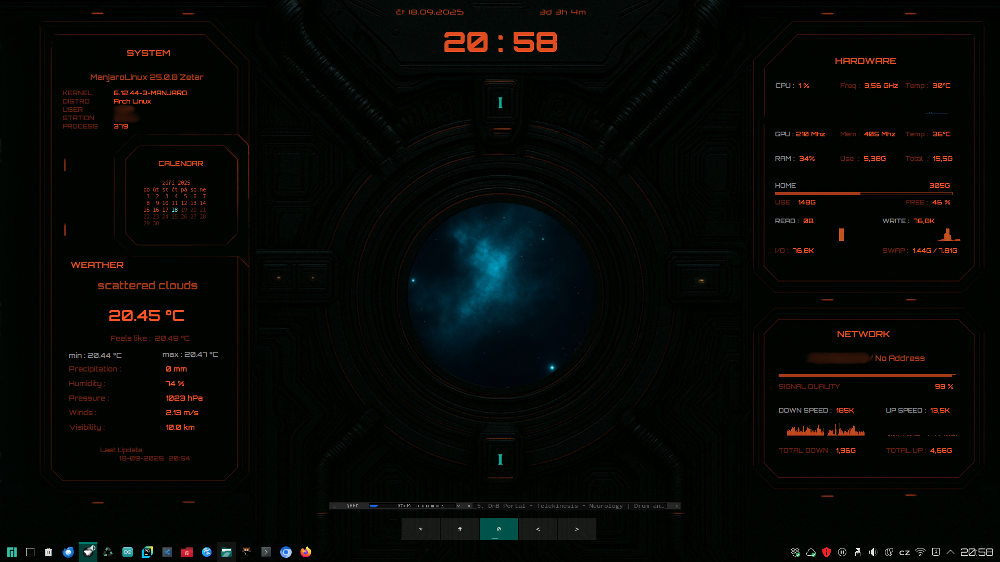
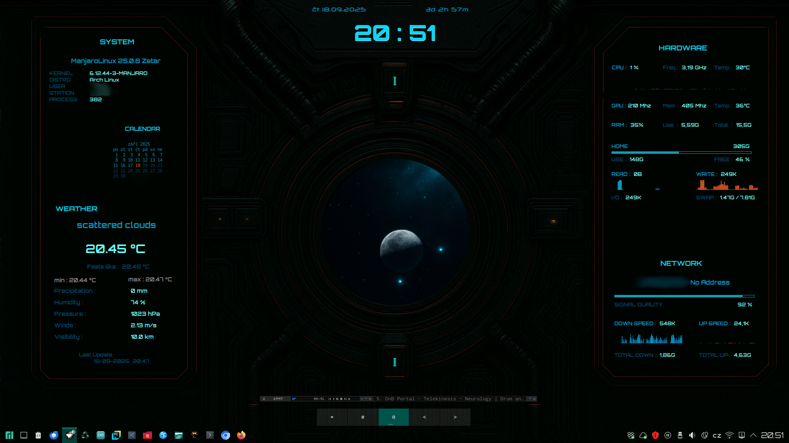

# Sci_conky
Sci-fi conky theme     
The repository contains the following directories:    
- Blue :         contains conky.config files for the blue version
- Orange :       contains conky.config files for the orange version
- wall :         here are the background wallpapers
- fonts :        with the fonts used
- conky_pocasi : weather.sh bash script that uses the API from https://openweathermap.org to get weather data.     
                 The data is saved in a .txt file, from where conky loads it weather.conf.     
----

Changing colors: open the blue/orange directory and copy all files to the main directory and run conky-startup.sh.      

----      

Wallpapers are created with Dall-E and Copilot and compiled in Krita editor.    

----      

For more my conky.config for x11 go to: [Codehack.cz](https://codehack.cz/conky.html#gsc.tab=0)     
Conky project [Homepage](https://github.com/brndnmtthws/conky/wiki)      

----     

     

